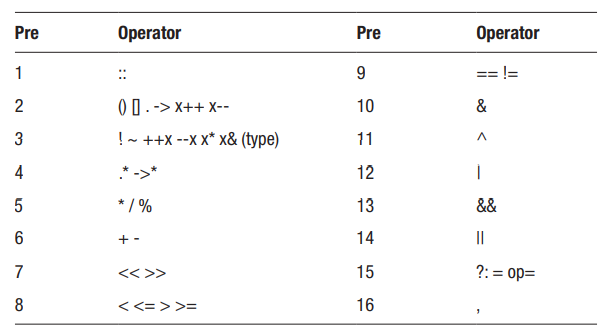

# **C Plus Plus**

---

# **Variable**

---

## **Data Types**

| Data Type   | Size (Byte) | Description           |
| ----------- | ----------- | --------------------- |
| char        | 1           | Integer or character  |
| short       | 2           |                       |
| int         | 4 Integer   |                       |
| long        | 4 or 8      |                       |
| long long   | 8           |                       |
| float       | 4           |                       |
| double      | 8           | Floating-point number |
| long double | 8 or 16     |                       |
| bool        | 1           | Boolean value         |

## **Variable Scope**

```cpp
int globalVar; // initialized to 0
int main()
{
    int localVar; // uninitialized
}
```

> The default values for these variables are also different. Global variables are automatically initialized to zero by the compiler, whereas local variables are not initialized at all. Uninitialized local variables will therefore contain whatever garbage is already present in that memory location

---

## **Integer Types**

---

- char myChar = 0; // -128 to +127
- short myShort = 0; // -32768 to +32767
- int myInt = 0; // -2^31 to +2^31-1
- long myLong = 0; // -2^31 to +2^31-1

```cpp
cout << sizeof(myChar) // 1 byte (per definition)
cout << sizeof(myShort) // 2
cout << sizeof(myInt) // 4
cout << sizeof(myLong) // 4
cout << sizeof(myL2); // 8

```

## Fixed sized

```cpp
#include <cstdint>
using namespace std;
int8_t myInt8 = 0; // 8 bits
int16_t myInt16 = 0; // 16 bits
int32_t myInt32 = 0; // 32 bits
int64_t myInt64 = 0; // 64 bits
```

## **Signed Integers**

```cpp
signed char myChar = 0; // -128 to +127
signed short myShort = 0; // -32768 to +32767
signed int myInt = 0; // -2^31 to +2^31-1
signed long myLong = 0; // -2^31 to +2^31-1
signed long long myL2 = 0; // -2^63 to +2^63-1
```

## **Unsigned Integers**

```cpp
unsigned char myChar = 0; // 0 to 255
unsigned short myShort = 0; // 0 to 65535
unsigned int myInt = 0; // 0 to 2^32-1
unsigned long myLong = 0; // 0 to 2^32-1
unsigned long long myL2 = 0; // 0 to 2^64-1
```

---

The signed and unsigned keywords may be used as standalone types,
which are short for signed int and unsigned int.

```cpp
unsigned uInt; // unsigned int = unsigned
signed sInt; // signed int = signed
short myShort; // short int = short
long myLong; // long int = long
```

---

---

# **Numeric Literals**

---

```cpp
int myOct = 062; // octal notation (0)
int myHex = 0x32; // hexadecimal notation (0x)
int myBin = 0b0011'0010; // binary notation (0b) = 50
```

---

# **Assignment Operators**

---

```cpp
x += 5; // x = x+5;
x -= 5; // x = x-5;
x *= 5; // x = x*5;
x /= 5; // x = x/5;
x %= 5; // x = x%5;
```

## Increment and Decrement Operators

```cpp
x++; // x = x+1;
x--; // x = x-1;
x++; // post-increment
x--; // post-decrement
++x; // pre-increment
--x; // pre-decrement
```

```cpp
int x, y;
x = 5; y = x++; // y=5, x=6
x = 5; y = ++x; // y=6, x=6
```

## Comparison Operators

```cpp
bool b = (2 == 3); // false // equal to
bool b = (2 != 3); // true // not equal to
bool b = (2 > 3); // false // greater than
bool b = (2 < 3); // true // less than
bool b = (2 >= 3); // false // greater than or equal to
bool b = (2 <= 3); // true // less than or equal to
```

---

## Logical Operators

```cpp
bool b = (true && false); // false // logical and
bool b = (true || false); // true // logical or
bool b = !(true); // false // logical not
```

## Bitwise Operators

```cpp
int x = 5 & 4; // 101 & 100 = 100 (4) // and
int x = 5 | 4; // 101 | 100 = 101 (5) // or
int x = 5 ^ 4; // 101 ^ 100 = 001 (1) // xor
int x = 4 << 1; // 100 << 1 =1000 (8) // left shift
int x = 4 >> 1; // 100 >> 1 = 10 (2) // right shift
int x = ~4; // ~00000100 = 11111011 (-5) // invert
```

The bitwise operators also have combined assignment operators.

```cpp
int x=5; x &= 4; // 101 & 100 = 100 (4) // and
int x=5; x |= 4; // 101 | 100 = 101 (5) // or
int x=5; x ^= 4; // 101 ^ 100 = 001 (1) // xor
int x=5; x <<= 1;// 101 << 1 =1010 (10)// left shift
int x=5; x >>= 1;// 101 >> 1 = 10 (2) // right shift
```

## Operator Precedence



---

# **Pointers**

---

## Creating Pointers

```cpp
int* p; // pointer to an integer
int *q; // alternative syntax
```

> A pointer can point to a variable of the same type by prefixing that variable with an ampersand, in order to retrieve its address and assign it to the pointer. The ampersand is known as the address-of operator (&).

```cpp
int i = 10;
p = &i; // address of i assigned to p
```

## Dereferencing Pointers | `*`

```cpp
#include <iostream>
using namespace std;
int main()
{
    int i = 10;
    int* p = &i;
    cout << "Address of i: " << p << endl; // ex. 0017FF1C
    cout << "Value of i: " << *p << endl; // 10
}
```

Modify

```cpp
p = &i; // address of i assigned to p
*p = 20; // value of i changed through p
```

```cpp
int* p2 = p; // copy of p (copies address stored in p)
```

## Pointing to a Pointer

```cpp
int** r = &p; // pointer to p (assigns address of p)
```

```cpp
cout << "Address of p: " << r << endl; // ex. 0017FF28
cout << "Address of i: " << *r << endl; // ex. 0017FF1C
cout << "Value of i: " << **r << endl; // 20
```

## Dynamic Allocation

```cpp
int* d = new int; // dynamic allocation
```

```cpp
delete d; // release allocated memory
```

## Null Pointer

```cpp
int* g = 0; // null pointer (unused pointer)
int* h = NULL; // null pointer
```

> In the early days before C++11, the constant NULL or the integer zero were used to symbolize null. The NULL constant is defined in the stdio.h standard library file, which is included through iostream

```cpp
#include <iostream> // include nullptr_t type
int main()
{
    int* p = nullptr; // ok
    int i = nullptr; // error
    bool b = (bool) nullptr; // false
    nullptr_t mynull = nullptr; // ok
}
```

> The advantage of using nullptr is that unlike an integer zero, nullptr will not implicitly convert to an integer type. The literal has its own type, nullptr_t, which can only be implicitly converted to pointer and bool types.

Trying to dereference such a pointer will cause a
runtime error.

```cpp
#include <iostream> // include nullptr_t type
int main()
{
    int* m = new int; // allocate memory for object
    delete m; // deallocate memory
    *m = 5; // error: write access violation
}
```

> To help prevent this, the deleted pointer should be set to null. Note that trying to delete an already deleted null pointer is safe. However, if the pointer has not been set to null, attempting to delete it again will cause memory corruption and possibly crash the program.

```cpp
#include <iostream> // include nullptr_t type
int main()
{
    int* m = new int; // allocate memory for object
    delete m;
    m = nullptr; // mark as null pointer
    delete m; // safe
}
```

Since you may not always know whether a pointer is valid, a check should be made whenever a pointer is dereferenced to make sure that it is not null

```cpp
if (m != nullptr) { *m = 5; } // check for valid pointer
if (m) { *m = 5; } // alternative
```

---

---

# **References**

---

```cpp
int x = 5;
int& r = x; // r is an alias to x
int &s = x; // alternative syntax
```

```cpp
r = 10; // assigns value to r/x
```

---

# **References and Pointers**

---

```cpp
int* ptr = &x; // ptr assigned address to x
```

---

# **Reference and Pointer Guideline**

---

```cpp
int* ptr = 0; // null pointer
int& ref = *ptr;
ref = 10; // error: invalid memory access
```

---

# **Rvalue Reference**

---

```cpp
int&& ref = 1 + 2; // rvalue reference
```

```cpp
ref += 3;
cout << ref; // "6"
```

---

# **Arrays**

---

## Array Declaration and Allocation

```cpp
int myArray[3]; // integer array with 3 elements
```

## Array Assignment

```cpp
myArray[0] = 1;
myArray[1] = 2;
myArray[2] = 3;
```

```cpp
int myArray[3] = { 1, 2, 3 };
int myArray[] = { 1, 2, 3 };
```

```cpp
int x = myArray[0]; // 1
```

## Multi-Dimensional Arrays

```cpp
int myArray[2][2] = { { 0, 1 }, { 2, 3 } };
myArray[0][0] = 0;
myArray[0][1] = 1;
```

```cpp
int mArray[2][2] = { 0, 1, 2, 3 }; // alternative
```

## Dynamic Arrays

```cpp
int* p = new int[3]; // dynamically allocated array
```

```cpp
*(p+1) = 10; // p[1] = 10;
```

## Array Size

```cpp
int myArray[2] = { 1, 2 };
myArray[2] = 3; // error: out of bounds
```

```cpp
int length = sizeof(myArray) / sizeof(int); // 2
```

```cpp
int size = 3;
int* p = new int[size]; // dynamically allocated array
```

```cpp
delete[] p; // release allocated array
p = nullptr; // mark pointer as unused
```

---

# **Strings**

---

```cpp
#include <string>
```

```cpp
string h = "Hello";
string w (" World");
```

## String Combining

```cpp
string a = h + w; // Hello World
h += w; // Hello World
```

```cpp
string b = "Hello" + w; // ok
```

It cannot concatenate two C strings or two string literals. To do this, one of the values has to be explicitly cast to a string.

```cpp
char *c = "World"; // C-style string
b = (string)c + c; // ok
b = "Hello" + (string)" World"; // ok
```

```cpp
b = "Hel" "lo"; // ok
```

## Escape Characters

```cpp
string s = "Hello \
            World";
```

```cpp
s = "Hello\nWorld";
```

**\n** Newline
**\f** Form feed
**\t** Horizontal tab
**\a** Alert sound
**\v** Vertical tab
**\'** Single quote
**\b** Backspace
**\"** Double quote
**\r** Carriage return
**\\** Backslash
**\0** Null character

## String Compare

```cpp
string s = "Hello";
bool b = (s == "Hello"); // true
```

## String Functions

```cpp
size_t i = s.length(); // 5, length of string
i = s.size(); // 5, same as length()
```

```cpp
s.substr(0,2); // "He"
```

```cpp
char c = s[0]; // 'H'
```

---

# **Conditionals**

---

## If Statement

```cpp
#include <iostream>
using namespace std;
int main()
{
    if (x < 1) {
        cout << x << " < 1";
    }
    else if (x > 1) {
        cout << x << " > 1";
    }
    else {
        cout << x << " == 1";
    }
}

```

```cpp
#include <iostream>
using namespace std;
int main()
{
    if (x < 1)
        cout << x << " < 1";
    else if (x > 1)
        cout << x << " > 1";
    else
        cout << x << " == 1";
}

```

## Switch Statement

```cpp
#include <iostream>
using namespace std;
int main()
{
    int x = 5;
    switch (x)
    {
    case 0:
        cout << x << " is 0";
        break;
    case 1:
        cout << x << " is 1";
        break;
    default:
        cout << x << " is not 1 or 2";
        break;
    }
}
```

## Ternary Operator

```cpp
x = (x < 0.5) ? 0 : 1; // ternary operator (?:)
```

```cpp
(x < 0.5) ? x = 0 : x = 1; // alternative syntax
```

## Initializers [C++17]

```cpp
#include <iostream>
using namespace std;
int main()
{
    int a = 2, b = 3;
    if (int sum = a + b; sum == 5)
    {
        cout << sum << " is 5";
    }
}
```

> To assist with this, C++17 introduced the ability to declare and initialize a locally-scoped variable for an if statement, by adding an initializer before the condition. This reduces the scope of the variable so that it is only visible within the body of the if statement and any accompanying else clauses.

---

# **Loops**

---

## While Loop

```cpp
#include <iostream>
using namespace std;
int main()
{
    int i = 0;
    while (i < 10)
    {
        cout << i++; // 0-9
    }
}
```

## Do-while Loop

```cpp
#include <iostream>
using namespace std;
int main()
{
    int j = 0;
    do
    {
        cout << j++; // 0-9
    } while (j < 10);
}
```

## For Loop

```cpp
#include <iostream>
using namespace std;
int main()
{
    for (int k = 0; k < 10; k++)
    {
        cout << k; // 0-9
    }
}
```

```cpp
#include <iostream>
using namespace std;
int main()
{
    for (int k = 0, m = 0; k < 5; k++, m--)
    {
        cout << k + m; // "00000"
    }
}
```

```cpp
#include <iostream>
using namespace std;
int main()
{
    for (;;)
    {
        cout << "infinite loop";
    }
}
```

```cpp
#include <iostream>
using namespace std;
int main()
{
    int a[3] = {1, 2, 3};
    for (int &i : a)
    {
        cout << i; // "123"
    }
}
```

## Break and Continue

```cpp
#include <iostream>
using namespace std;
int main()
{
    for (int i = 0; i < 10; i++)
    {
        if (i == 5)
            break; // end loop
        if (i == 3)
            continue; // start next iteration
        cout << i;    // "0124"
    }
}
```

## Goto Statement

```cpp
goto myLabel; // jump to label
myLabel: // label declaration
```

---

# **Functions**

---

```cpp
#include <iostream>
using namespace std;
void myFunction(int a, int b)
{
    cout << a + b;
}
int main()
{
    myFunction(12, 34); // 46
}
```

## Function Overloading

```cpp
#include <iostream>
using namespace std;
void myFunction(string a, string b)
{
    cout << a + " " + b;
}
void myFunction(string a)
{
    cout << a;
}
void myFunction(int a)
{
    cout << a;
}
int main()
{
    myFunction("Hello", "World");
    myFunction("Hello");
    myFunction(10);
}
```

## Forward Declaration

```cpp
#include <iostream>
using namespace std;
void myFunction(string a, string b);
void myFunction(string a);
void myFunction(int a);
int main()
{
    myFunction("Hello", "World");
    myFunction("Hello");
    myFunction(10);
}
void myFunction(string a, string b)
{
    cout << a + " " + b;
}
void myFunction(string a)
{
    cout << a;
}
void myFunction(int a)
{
    cout << a;
}
```

## Pass by Value

```cpp
#include <iostream>
#include <string>
using namespace std;
void change(int i)
{
    i = 10;
}
void change(string s)
{
    s = "Hello World";
}
int main()
{
    int x = 0;     // value type
    change(x);     // value is passed
    cout << x;     // "0"
    string y = ""; // reference type
    change(y);     // object copy is passed
    cout << y;     // ""
}s
```

## Pass by Reference

```cpp
#include <iostream>
using namespace std;
void change(int &i)
{
    i = 10;
}
int main()
{
    int x = 0; // value type
    change(x); // reference is passed
    cout << x; // "10"
}
```

## Pass by Address

```cpp
#include <iostream>
using namespace std;
void change(int *i)
{
    *i = 10;
}
int main()
{
    int x = 0;  // value type
    change(&x); // address is passed
    cout << x;  // 10
}
```

## Return by Value, Reference, or Address

```cpp
#include <iostream>
using namespace std;
int byVal(int i)
{
    return i + 1;
}
int main()
{
    int a = 10;
    cout << byVal(a); // "11"
}
```

```cpp
#include <iostream>
using namespace std;
int &byRef(int &i)
{
    return i;
}
int main()
{
    int a = 10;
    cout << byRef(a); // "10"
}
```

```cpp
#include <iostream>
using namespace std;
int *byAdr(int *i)
{
    return i;
}
int main()
{
    int a = 10;
    cout << *byAdr(&a); // "10"
}
```

## Inline Functions

```cpp
inline int myInc(int i)
{
    return i++;
}
```

## Auto and Decltype

```cpp
auto i = 5; // int
auto d = 3.14; // double
auto b = false; // bool
```

```cpp
int& iRef = i;
auto myAuto = iRef; // int
```

```cpp
auto& myRef = iRef; // int&
```

## Returning Multiple Values

## Lambda Functions

```cpp
#include <iostream>
using namespace std;
auto sum = [](int x, int y) -> int {
    return x + y;
};
int main()
{
    cout << sum(2, 3); // "5"
}
```

> In C++14: Note that the arrow operator (->) is also omitted when leaving out the return type

```cpp
#include <iostream>
using namespace std;
auto sum = [](int x, int y) {
    return x + y;
};

int main()
{
    cout << sum(2, 3); // "5"
}
```

```cpp
#include <iostream>
using namespace std;
auto sum = [](auto x, auto y) {
    return x + y;
};

int main()
{
    cout << sum(2, 3); // "5"
}
```

> Lambdas are typically used for specifying simple functions that are only referenced once, often by passing the function object as an argument to another function

```cpp
#include <iostream>
#include <functional>
using namespace std;
void call(int arg, function<void(int)> func)
{
    func(arg);
}
int main()
{
    auto printSquare = [](int x) {
        cout << x * x;
    };
    call(2, printSquare); // "4"
}
```

- All lambdas start with a set of square brackets, called the capture
  clause.
- This clause specifies variables from the surrounding scope that
  can be used within the lambda body

---

---

# **Classes**

---
